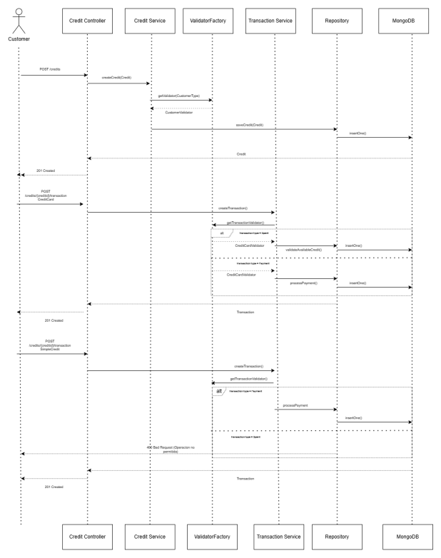

# Credits Microservice

## Descripción
Este microservicio es responsable de gestionar todas las operaciones relacionadas con los 
créditos bancarios. Permite la creación, consulta, actualización y eliminación de diferentes 
tipos de créditos, así como el registro y seguimiento de las transacciones asociadas a cada 
crédito. 

---

## Características Principales

### Gestión de Créditos
- Creación de nuevos créditos
- Consulta de créditos por ID
- Actualización de información de créditos existentes
- Eliminación de créditos
- Obtención de listados completos de créditos

### Gestión de Transacciones
- Registro de nuevas transacciones asociadas a créditos
- Consulta de transacciones por ID de crédito
- Consulta de todas las transacciones del sistema

### Características Técnicas
- Arquitectura hexagonal para separación clara de responsabilidades
- Implementación reactiva con Spring WebFlux
- Persistencia de datos con MongoDB reactivo
- Sistema de logging completo con Logback
- Endpoints RESTful para integración con otros microservicios

## Flujograma del microservicio

